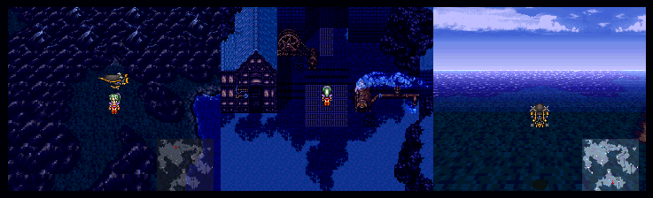

# FF6 Day-Night Cycle Project

This is a revival of my day-night cycle hack project that was about
90% completed back in 2018 but that was then abandoned.

## Base hack roadmap
- [x] Redo project structure
- [x] Create basic build script
- [x] Redo data spreadsheets
- [x] Convert the project from xkas 0.06 to bass v14
- [ ] Correct any bug with the code conversion
- [ ] Add to project compatible save files archive
- [ ] Test playthrough covering all changes and bugfixes if needed
- [ ] Improve code comments and documentation
- [ ] Beta testing round
- [ ] Release version 1.0 of the base hack

## Links

[2018 Youtube Teaser](https://www.youtube.com/watch?v=Zv1pSxsS8ww)

[2018 FF6Hacking forum thread](https://www.ff6hacking.com/forums/thread-3756.html)

[2018 FF6Hacking wiki page](https://www.ff6hacking.com/wiki/doku.php?id=ff3:ff3us:patches:madsiur:cycle)

## Screenshots

